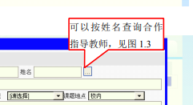

# 登录后进入教师模块


## 刷新教师课题到列表中（f & t）

1. 根据教师编号获取该教师的课题列表

   - 参数
     ```java
     int tutorid; // 教师编号
     ```

   - api（findSubjectByTutorid）
     ```json
     // 根据教师编号获取该教师的课题列表
     old_url: "../SubjectServlet/gets";
     url: "../api/subject"
     params:
     {
         tutorid: tutorid;  // 教师编号
     }
     return: 课题信息（包括错误信息）
     ```

2. 根据课题id查看课题详情 

   - 参数
     ```java
     int subid; // 课题id
     ```

   - api (findSubjectBySubid)
     ```json
     // 课题id查看课题详情 SyscodeBpo getcode
     old_url: "SubjectView.jsp";
     url: ""
     params:
     {
         subid: subid;
     }
     return: 当前课题详情（包括错误信息）
     ```

3. 根据学生id查看学生信息

   - 参数
     ```java
     int stuid;  // 学生id
     ```

   - api (findStudentByStuid)
     ```json
     old_url: "../StudentServlet/get";
     url: "../api/student/get"
     params:
     {
         stuid: stuid;
     }
     return: 学生信息
     ```

4. 查看设计情况（loading）

## 申报新课题功能(f & t)

```tex
打开课题新增、修改窗口
```

1. 判断是否可以继续申请课题 (f & t)

   - 参数
     ```java
     int currsubnum; // 当前课题数
     int maxsubnum;  // 最多可以申报的课题数
     ```


   - api (addSubjectByStuid)
     ```java
     old_url: "../SubjectServlet/edt";
     url: "../api/subject/edt"
     method: "post";
     params:
     {
         othertid: othertid;  // 其他教师编号
         othertname: othertname;  // 其他教师姓名
         subname: subname;  // 课题名称
         subsort: subsort;  // 课题类别
         subkind: subkind;  // 题目性质
         subsource: subsource;  // 题目来源
         subtype: subtype;  // 题目类型
         oldargu: oldargu;  // 设计概述
         workcontent: workcontent;  // 工作内容
         requirement: requirement;  // 工作基本要求
         // 工作日程
         refpapers: refpapers;  // 主要参考资料及文献
         speciality: speciality;  // 课题适合专业
         subdirectionselect: subdirectionselect;  // 课题方向
     }
     return: "学生信息";
     ```
     


2. 可以按姓名查询合作指导教师
   

   - 参数

   - api
     ```json
     old_url: "../TeacherServlet?mode=gets"
     url: "../api/teacher/gets"
     params:
     {
         tutorname: othername
     }
     return: "教师"
     ```

     

## 修改删除课题功能

### 修改功能

1. 流程

   1. 点击修改按钮，会按照课题id获取课题信息并且传给前端
   2. 修改后点击提交按钮，将数据传送给后端，后端会进行一个判断（当课题id为空时，则新增，否则修改）

2. 提交（f & t）

   - api (addSubjectByStuid)

     ```java
     old_url: "../SubjectServlet/edt";
     url: "../api/subject/edt"
     method: "post";
     params:
     {
         subid: subid;
         othertid: othertid;  // 其他教师编号
         othertname: othertname;  // 其他教师姓名
         subname: subname;  // 课题名称
         subsort: subsort;  // 课题类别
         subkind: subkind;  // 题目性质
         subsource: subsource;  // 题目来源
         subtype: subtype;  // 题目类型
         oldargu: oldargu;  // 设计概述
         workcontent: workcontent;  // 工作内容
         requirement: requirement;  // 工作基本要求
         // 工作日程
         refpapers: refpapers;  // 主要参考资料及文献
         speciality: speciality;  // 课题适合专业
         subdirectionselect: subdirectionselect;  // 课题方向
     }
     return: "学生信息";
     ```


### 删除课题功能

`TeacherMsg.js` 的 `delsubject (String subid)`方法，删除后刷新列表

- param
  ```java
  String subid;  // 课题id
  ```

- api
  ```json
  old_url: "../SubjectServlet?mode=del"
  url: "../api/subject/del"
  method: "post"
  params:
  {
      subid: subid
  }
  ```

  


## 提交课题功能

## 选择学生功能


